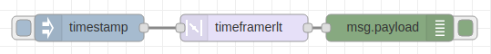

node-red-contrib-timeframerlt
(timeframe rate limit trigger)
=========================

[](http://github.com/eisbehr-/node-red-throttle)
[](http://www.npmjs.org/package/node-red-contrib-throttle)
[](https://david-dm.org/eisbehr-/node-red-throttle)

A <a href="http://nodered.org" target="_new">Node-RED</a> A Trigger and Rate Limit Node to pass messages if user count has been met within a defined user time frame.

---

## Table of Contents
* [Install](#install)
* [Usage](#usage)
  * [Timeframe](#by-time)
  * [Count Persistent](#count-persistent)
  * [Count Terminable](#count-terminable)
* [Example Flows](#example-flows)
  * [Example by Count Persistent](#example-by-count-persistent)
  * [Example by Count Terminable](#example-by-count-terminable)
* [Bugs / Feature request](#bugs--feature-request)
* [License](#license)
* [Work](#work)
* [Contributor of Project](#contributor)

---

## Install

Run the following command in your Node-RED user directory - typically `~/.node-red`:

```
npm install node-red-contrib-timeframerlt
```


## Usage

A Trigger and Rate Limit Node to pass messages if user count has been met within a defined user time frame.
Just insert the node in between two others. Then the ammount of messages received in a certain time frame to trigger can be limited by different parameter selections.


### Timeframe

Amount of time given before message trigger event is reset.
**For example:** setting the node to `10 seconds` means, that you have ten seconds to reach enough messages to trigger one message to be forwarded.


### Count Persistent

Ammount of messages needed to trigger before one message is passed through. Persistent, If triggered the count is reset and it can be triggered again.
**For example:** setting the node to a count of `5` means, that five messages are needed within the specified timeframe before one message will be forwarded.


### Count Terminable

Will only pass through a single message, ONCE! Hence Terminable. When the ammount of messages needed active the trigger is reached. The trigger can be reset to send message when conditions are met again with `msg.reset`.
**For example:** setting the node to a count of `5` means, that five messages are needed within the specified timeframe before one message will be forwarded Once, One time, and never again, even if conditions are met again.


## Example Flows

Simple examples showing how to use the timeframerlt (timeframe rate limit trigger) and it's output.


### Example by Count Persistent



```JSON
[{"id":"b0b8b22c.dd0f6","type":"inject","z":"99d92ba1.9f3598","name":"","topic":"","payload":"","payloadType":"date","repeat":"","crontab":"","once":false,"onceDelay":0.1,"x":140,"y":160,"wires":[["2dbeb200.2d534e"]]},{"id":"d9a532a2.d8d81","type":"debug","z":"99d92ba1.9f3598","name":"","active":true,"tosidebar":true,"console":false,"tostatus":false,"complete":"payload","x":470,"y":160,"wires":[]},{"id":"2dbeb200.2d534e","type":"timeframerlt","z":"99d92ba1.9f3598","name":"","throttleType":"count","timeLimit":"2","timeLimitType":"seconds","countLimit":"4","byresetcountLimit":"4","x":310,"y":160,"wires":[["d9a532a2.d8d81"]]}]
```


### Example by Count Terminable


```JSON
[{"id":"b0b8b22c.dd0f6","type":"inject","z":"99d92ba1.9f3598","name":"","topic":"","payload":"","payloadType":"date","repeat":"","crontab":"","once":false,"onceDelay":0.1,"x":140,"y":160,"wires":[["2dbeb200.2d534e"]]},{"id":"d9a532a2.d8d81","type":"debug","z":"99d92ba1.9f3598","name":"","active":true,"tosidebar":true,"console":false,"tostatus":false,"complete":"payload","x":470,"y":160,"wires":[]},{"id":"2dbeb200.2d534e","type":"timeframerlt","z":"99d92ba1.9f3598","name":"","throttleType":"reset","timeLimit":"2","timeLimitType":"seconds","countLimit":"4","byresetcountLimit":"4","x":310,"y":160,"wires":[["d9a532a2.d8d81"]]},{"id":"f596a515.6d8208","type":"inject","z":"99d92ba1.9f3598","name":"","topic":"","payload":"","payloadType":"date","repeat":"","crontab":"","once":false,"onceDelay":0.1,"x":140,"y":120,"wires":[["4296a6a.3809758"]]},{"id":"4296a6a.3809758","type":"change","z":"99d92ba1.9f3598","name":"","rules":[{"t":"set","p":"reset","pt":"msg","to":"payload","tot":"msg"}],"action":"","property":"","from":"","to":"","reg":false,"x":300,"y":120,"wires":[["2dbeb200.2d534e"]]}]
```


## Bugs / Feature request
Please [report](http://github.com/meeki007/node-red-contrib-timeframe-rate-limit-trigger/issues) bugs and feel free to [ask](http://github.com/meeki007/node-red-contrib-timeframe-rate-limit-trigger/issues) for new features directly on GitHub.


## License
This project is licensed under [Apache 2.0](http://www.apache.org/licenses/LICENSE-2.0) license.


## Work
_Need a node?
_Need automation work?
_Need computers to flip switches?
  
Contact me at meeki007@gmail.com


## Contributor of Project

Thanks to [SunValleyFoods](https://www.sunvalleyfoods.com/) for being a buisness that supports opensource. They needed this node for a tempsensor monitoring and automation project for their freezers and cooers.

Thanks to allot of code written by Daniel 'Eisbehr' Kern and his [node-red-contrib-throttle](http://github.com/eisbehr-/node-red-throttle). I based and copied allot of code off his work as his node did not quite do what i needed.


end.
